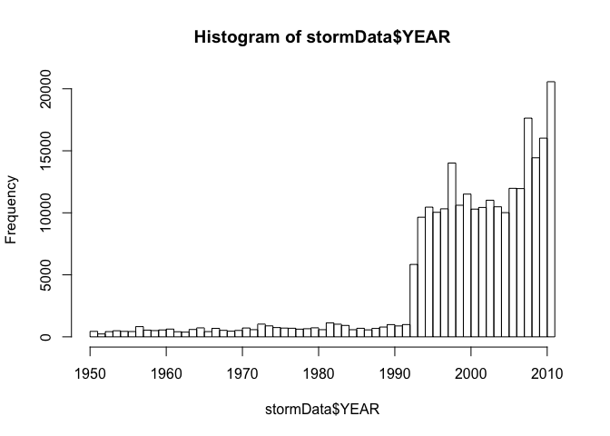
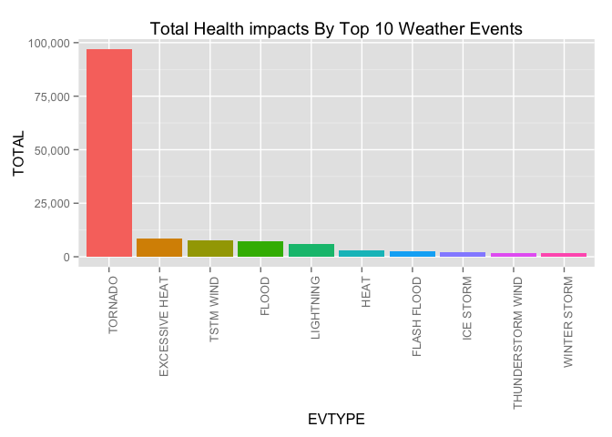
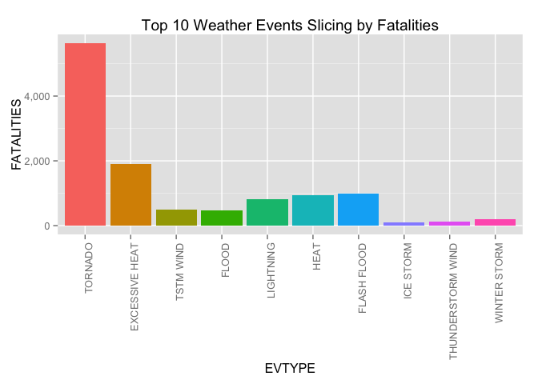
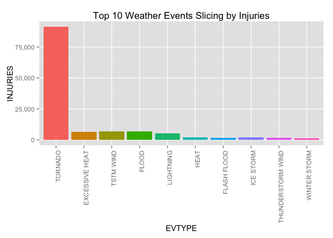
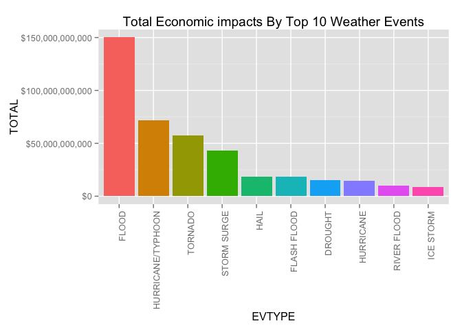
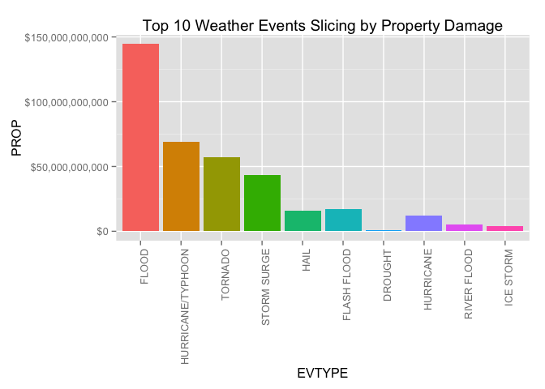
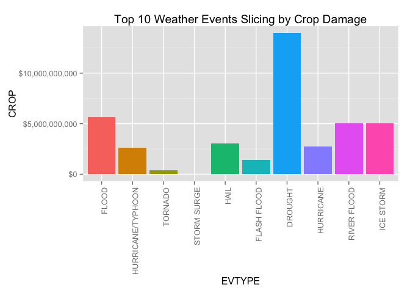

```r
library(knitr)
library(tidyr)
library(dplyr)
library(lubridate)
library(ggplot2)
library(scales)
```


```r
Sys.setlocale("LC_TIME","C")
```

```
## [1] "C"
```

```r
options(scipen=6)
opts_chunk$set(cache=TRUE)
# NOTES: 'opts_chunk$set(cache=TRUE)' is knitr cache option.
# knitr has cache issue. If you encount some error when you try reproducible research.
# please set 'cache=FALSE' or remove cache dir 'PA2_cache'.
```

## Synopsis

This report analysis the U.S. National Oceanic and Atmospheric Administration's 
(NOAA) storm database in order to answer the following two questions:

1. Which types of events are most harmful to population health?
2. Which types of events have the greatest economic consequences?

**About This report's dataset:**

* [Storm Data from the NOAA Database](https://d396qusza40orc.cloudfront.net/repdata%2Fdata%2FStormData.csv.bz2)
* [National Weather Service Storm Data Documentation](https://d396qusza40orc.cloudfront.net/repdata%2Fpeer2_doc%2Fpd01016005curr.pdf)
* [National Climatic Data Center Storm Events FAQ](https://d396qusza40orc.cloudfront.net/repdata%2Fpeer2_doc%2FNCDC%20Storm%20Events-FAQ%20Page.pdf)

## Data Processing
### Getting Data

Get and read The Storm Data into R and extract the focuses row and columns.  
This analysis focuses theses row and columns of the original dataset  
to answer above the questions:  

*Row*  
I extract rows indicate Public Health or Economic Problems impact is greater than 0.  


*Column*  
I extract columns describe Public Health or Economic Problems impact.  

|Field Name|Description|
|---|---|
|BGN_DATE|Event date|
|EVTYPE|Event type|
|FATALITIES|Population health fatalityies|
|INJURIES|Population health injuries|
|PROPDMG|Economic property damage|
|PROPDMGEXP|PROPDMG's exponent|
|CROPDMG|Economic crop damage|
|CROPDMGEXP|CROPDMG's exponent|


```r
fileName <- 'repdata-data-StormData.csv.bz2'
fileURI <- 'https://d396qusza40orc.cloudfront.net/repdata%2Fdata%2FStormData.csv.bz2'

if(!file.exists(fileName)) {
  download.file(fileURI, fileName, method = 'curl')
}
stormData <- read.csv(bzfile(fileName),stringsAsFactors = FALSE)

stormData <- stormData %>%
    filter(FATALITIES > 0 | INJURIES > 0 | PROPDMG > 0 | CROPDMG > 0) %>%
    select(BGN_DATE, EVTYPE, FATALITIES, INJURIES,
            PROPDMG, PROPDMGEXP, CROPDMG, CROPDMGEXP
        ) %>% mutate(BGN_DATE = mdy_hms(BGN_DATE))
    
str(stormData)
```

```
## 'data.frame':	254633 obs. of  8 variables:
##  $ BGN_DATE  : POSIXct, format: "1950-04-18" "1950-04-18" ...
##  $ EVTYPE    : chr  "TORNADO" "TORNADO" "TORNADO" "TORNADO" ...
##  $ FATALITIES: num  0 0 0 0 0 0 0 0 1 0 ...
##  $ INJURIES  : num  15 0 2 2 2 6 1 0 14 0 ...
##  $ PROPDMG   : num  25 2.5 25 2.5 2.5 2.5 2.5 2.5 25 25 ...
##  $ PROPDMGEXP: chr  "K" "K" "K" "K" ...
##  $ CROPDMG   : num  0 0 0 0 0 0 0 0 0 0 ...
##  $ CROPDMGEXP: chr  "" "" "" "" ...
```

### Cleaning Data

Create economic damge number fields with DMG and DMGEXP columns.
DMGEXP raw format is unit prefix(e.g. k, m, M),  
So I convert it and calculate damage number and add berow the columns.

|Field Name|Description|
|---|---|
|PROPDMGNUM|Economic property damage impact number(USD)|
|CROPDMGNUM|Economic crop damage impact number(USD)|


```r
calcDmg <- function(dmg, exp){
    pw <- 0
    exp<-tryCatch(as.numeric(exp), warning=function(e){exp})
    if(is.numeric(exp)){
        pw <- exp 
    } else if(grepl("h", exp, ignore.case = TRUE)){
        pw <- 2
    } else if(grepl("k", exp, ignore.case = TRUE)){
        pw <- 3
    } else if(grepl("m", exp, ignore.case = TRUE)){
        pw <- 6
    } else if(grepl("b", exp, ignore.case = TRUE)){
        pw <- 9
    }  
    num <- dmg * (10^pw)
    return(num)
}

stormData$PROPDMGNUM  <- mapply(calcDmg,stormData$PROPDMG,stormData$PROPDMGEXP)
stormData$CROPDMGNUM <- mapply(calcDmg,stormData$CROPDMG,stormData$CROPDMGEXP)
```

## Results
### Overview


```r
stormData$YEAR<-as.numeric(format(stormData$BGN_DATE, "%Y"))
hist(stormData$YEAR,
     breaks=seq(min(stormData$YEAR),max(stormData$YEAR),by=1),
     freq = TRUE)
```

 

The number of events significantly increase around 1993.
It maybe caused storm data database developed aroud this year.
But It aside, recent years (2008-2011) it remarkble increased.

### Health impacts

**Which types of events are most harmful to population health?**


```r
health.impacts <- stormData %>% group_by(EVTYPE) %>%
    summarise(FATALITIES=sum(FATALITIES),
              INJURIES=sum(INJURIES),
              TOTAL=FATALITIES+INJURIES) %>%
    arrange(desc(TOTAL),desc(FATALITIES),desc(INJURIES))
health.impacts.Total10<-head(health.impacts,10)
health.impacts.Total10$EVTYPE<-factor(health.impacts.Total10$EVTYPE,
                                       levels=health.impacts.Total10$EVTYPE)

ggplot(data=health.impacts.Total10,aes(x=EVTYPE,y=TOTAL,fill=EVTYPE)) +
        geom_bar(stat="identity") +
        scale_y_continuous(labels = comma) +
        ggtitle("Total Health impacts By Top 10 Weather Events") +
        theme(axis.text.x = element_text(angle = 90, hjust = 1),
              legend.position = "none")
```

 

```r
ggplot(data=health.impacts.Total10,aes(x=EVTYPE,y=FATALITIES,fill=EVTYPE)) +
        geom_bar(stat="identity") +
        scale_y_continuous(labels = comma) +
        ggtitle("Top 10 Weather Events Slicing by Fatalities") +
        theme(axis.text.x = element_text(angle = 90, hjust = 1),
              legend.position = "none")
```

 

```r
ggplot(data=health.impacts.Total10,aes(x=EVTYPE,y=INJURIES,fill=EVTYPE)) +
        geom_bar(stat="identity") +
        scale_y_continuous(labels = comma) +
        ggtitle("Top 10 Weather Events Slicing by Injuries") +
        theme(axis.text.x = element_text(angle = 90, hjust = 1),
              legend.position = "none")
```

 

Three charts indicate Tornado is most harmful to population health.

### Economic impacts

**Which types of events have the greatest economic consequences?**


```r
eco.impacts <- stormData %>% group_by(EVTYPE) %>%
    summarise(PROP=sum(PROPDMGNUM, na.rm = TRUE),
              CROP=sum(CROPDMGNUM, na.rm = TRUE),
              TOTAL=PROP+CROP) %>%
    arrange(desc(TOTAL),desc(PROP),desc(CROP))
eco.impacts.Total10<-head(eco.impacts,10)
eco.impacts.Total10$EVTYPE<-factor(eco.impacts.Total10$EVTYPE,
                                      levels=eco.impacts.Total10$EVTYPE)

ggplot(data=eco.impacts.Total10,aes(x=EVTYPE,y=TOTAL,fill=EVTYPE)) +
        geom_bar(stat="identity") +
        scale_y_continuous(labels = dollar) +
        ggtitle("Total Economic impacts By Top 10 Weather Events") +
        theme(axis.text.x = element_text(angle = 90, hjust = 1),
              legend.position = "none")
```

 

```r
ggplot(data=eco.impacts.Total10,aes(x=EVTYPE,y=PROP,fill=EVTYPE)) +
        geom_bar(stat="identity") +
        scale_y_continuous(labels = dollar) +
        ggtitle("Top 10 Weather Events Slicing by Property Damage") +
        theme(axis.text.x = element_text(angle = 90, hjust = 1),
              legend.position = "none")
```

 

```r
ggplot(data=eco.impacts.Total10,aes(x=EVTYPE,y=CROP,fill=EVTYPE)) +
        geom_bar(stat="identity") +
        scale_y_continuous(labels = dollar) +
        ggtitle("Top 10 Weather Events Slicing by Crop Damage") +
        theme(axis.text.x = element_text(angle = 90, hjust = 1),
              legend.position = "none")
```

 

```r
crop.scale <- round(sum(eco.impacts$CROP,na.rm = TRUE)/sum(eco.impacts$PROP,na.rm = TRUE),2)
```

Total and Property Damage charts indicate Flood, Hurricane/Typoon and Tornado  
are the greatest economic consequences.
And also, Crop Damage charts indicate Drought is  
the greatest economic consequences in crop.

## Conclustions

* Tornado is most harmful to population health.
* Flood, Hurricane/Typoon and Tornado are the greatest economic consequences.
* However, in crop damage, Drought also has the greatest economic consequences.
